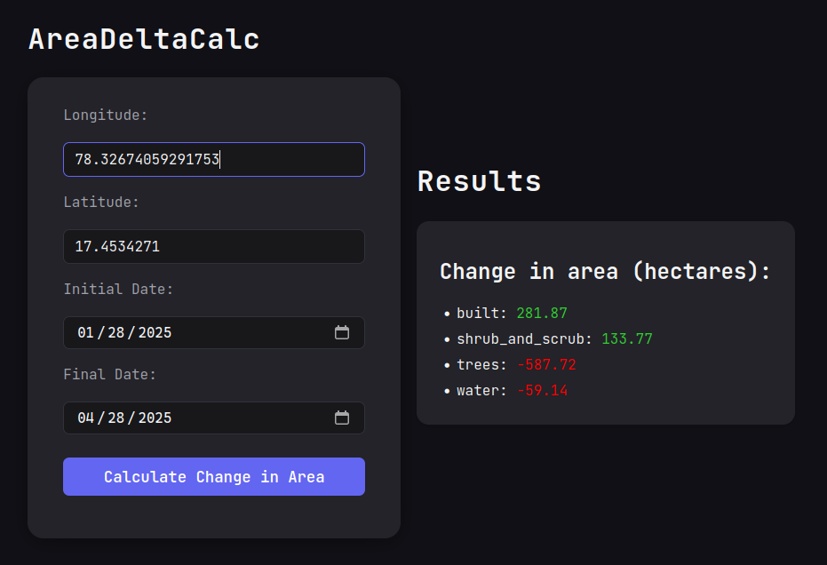

# AreaDeltaCalc using DynamicWorld

This repo contains Python code and data used for a mini project as part of our <b>Water and Wastewater Treatment</b> course (CE F342). A simple web app has been made using Flask to make it more accessible.

## Libraries

Followin Python libraries are used:

* `earthengine-api`: Python client libraries for calling the Google Earth Engine API
* `flask`: A simple framework for building complex web applications

## Group Members

* <b>Meghraj Goswami</b> - 2022A2B41869H
* <b>Rajat Sambare</b> - 2022A2PS1427H
* <b>Harshitha K</b> - 2022A2PS1721H
* <b>Taruni Mallu</b> - 2022A2PS1139H